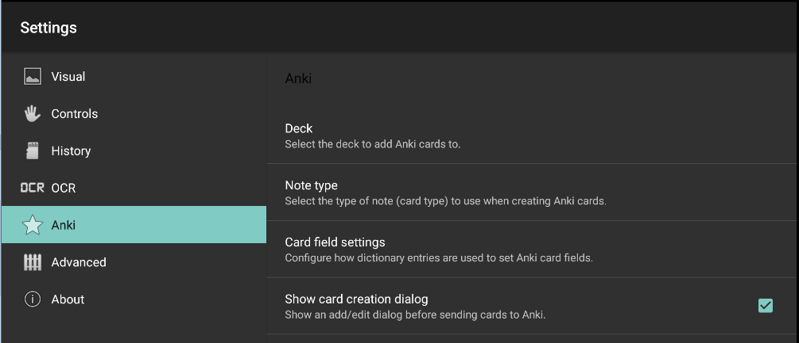
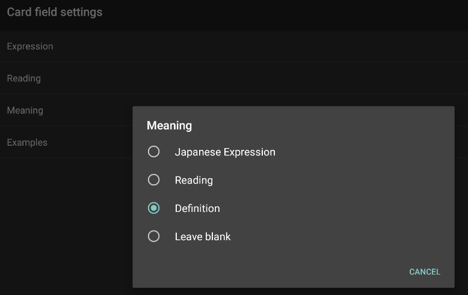
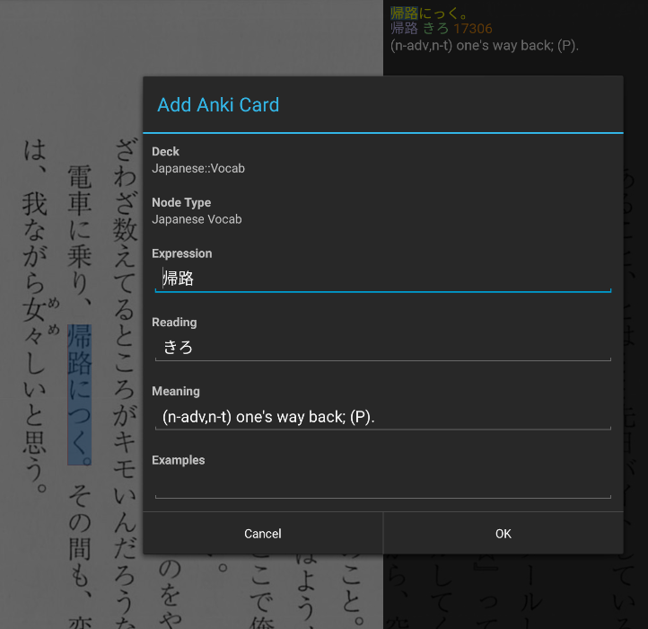

Customized OCR Manga Reader for Android
=======================================

Overview
---------

A customized version of OCR Manga Reader 6.1 (http://ocrmangareaderforandroid.sourceforge.net/)
that allows for greater control in the manner in which Anki cards are created by 
supporting card types (notes) with more than 2 fields (not just front and back).

Users can specify the deck and note type to use when adding cards, and can
configure how dictionary entry values  map to fields on the cards. Notes may
contain any number of fields, but should typically have 3 to accomodate the
following dictionary entry values:

* Japanese expression
* Reading
* Definition (English meaning)

An add/edit pop-up dialog is shown when a card is sent to Anki. This dialog can
be disabled if needed, to streamline card creation.

The app requires a fairly recent version of AnkiDroid to be installed (>= 2.5).
When using AnkiDroid < 2.5, the app will fallback to using the previous card
creation functionality, where cards are created as follows:

* Front: Japanese expression + [Reading]
* Back: English definition

Only tablets supported at this stage.

Screenshots
-----------

**Anki settings:**

**Card creation pop-up dialog:**

